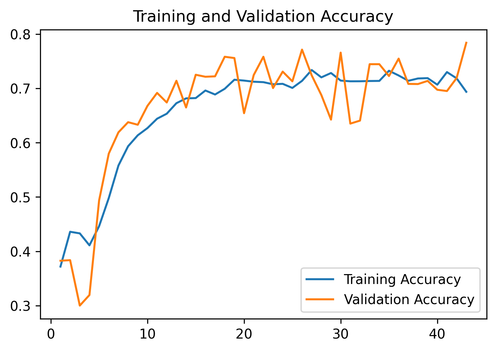
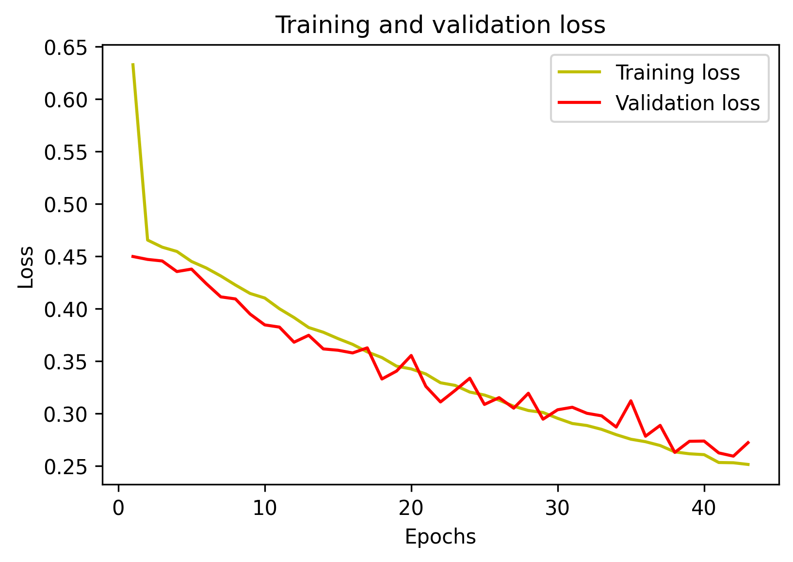

# Demographic-details-identification-from-a-Surveillance-video
This repo helps in identifying the Age and Gender of persons in a Surveillance Video usually from far view camera video,
where there is a difficulty in detetcting face and where most exisitng alogorithms use face for identifying Age and Gender.

This complete repo used DeepSort for object tracking and YOLOv4 for Object Detetction and Custom trainind NN for 
Identifaction of Age and Gender details.

### Approach
First Persons are identified in the video and thier tracking is observed and after they reach about half the screen I cropped
them and sent to my trained model which identified the Age and Gender.

Later I capture these deatails in AWS dynamo DB and make some analysis using the demographics. This work is still in progress.

All the work is done in Google Colab GPU.

### Demo

### Implemetation Steps
Follow as per this [Colab](https://colab.research.google.com/drive/1WrYo4VZgkXmQu2-vxJkukkF_RM_4HSbx?usp=sharing) Notebook.
This will setup the environment you need in your Drive.

You can download the Age and Gender detection model from [here](https://drive.google.com/drive/folders/1PnZFCMfpyCqZXDYZQz_nmKTWSbyhzx2l?usp=sharing) and paste the model folder inside model_data folder.

### The proposed CNN model and Implementation.

This identifiaction from far view images task is a multi label single class classification problem and is approached with a 
specialized convolutional neural network model that achieves an overall accuracy of 82.53%% for 7 attributes namely 
Male, Female, PersonAgeLess15, PersonAgeLess30, PersonAgeLess45, PersonAgeLess60 and PersonAgeLarger60 as defined in the 
[PETA](http://mmlab.ie.cuhk.edu.hk/projects/PETA.html) dataset which consists of far-view images of pedestrians.

#### Dataset Preprocessing and Augmentation
 Because of the varying size of the images in the dataset, the images are preprocessed. And for learning in a neural network the larger the training dataset, the better. I had used augmentation techniques to increase the training dataset of 15200 images.
 ##### 1. Image Resizing: 
 Resized all images to 60 x 120 size. Images that have lesser resolution are scaled to the target size using LINEAR interpolation and for the ones with the higher resolutions, they are shrunk using AREA interpolation. 
 ##### 2. Image Augmentation: 
Applied two augmentation techniques. Every images for training are flipped from right to left i.e. a horizontal flipping of the images were done to create new images. And they are also rotated with an angle between -14 to 14 degrees.

#### Proposed Network 
I have designed a convolutional neural network model for detecting the selected attributes from vertically oriented pedestrian images. The model has three convolutional layers and two fully connected layers. Every convolutional layer is followed by a max pooling layer. The first layer consists of 32 3x3 filters and the second layer consists of 64 3x3 filters which are followed by 2x2 max pool layers. The final layer has 128 1x5 filters. There are two fully connected layers consisting of 1024 neurons each with the final output layer that points to 7 nodes for the 7 selected attributes.
A dropout of 40% and 40% is used for the last 2 layers of the model.

  

#### Model Evaluation 
After several experiments with different learning rates and it is found that 0.0005 is the optimal learning rate which is run for 43 epochs for the finalized model for this task. 
The training accuracy and test accuracy achieved for this is 82.53% and 78.42% respectively.

There is still room for improvising the noetwork with the more training and quality data.
Below are the accuracy and oss while traiing the network.

  

#### References
* [PETA Dataset] (http://mmlab.ie.cuhk.edu.hk/projects/PETA.html)
* [DeepSort](https://github.com/nwojke/deep_sort)
* [Yolov4](https://github.com/hunglc007/tensorflow-yolov4-tflite)
* [The AI Guy](https://www.youtube.com/watch?v=_zrNUzDS8Zc)
* Architecture inspired from [this](https://ieeexplore.ieee.org/document/8944776) paper.
* Some ideas inpired from [this](https://github.com/LeonLok/Multi-Camera-Live-Object-Tracking) repo.

